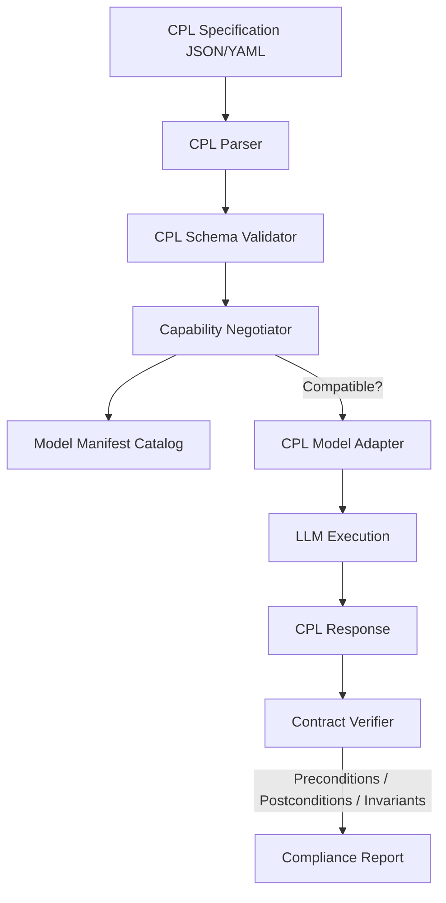

# Implementation Plan - CPL Open Source Framework

Build a comprehensive open-source implementation of the Common Prompt Language (CPL) framework. All code, CLI tools, tests, and documentation will reside strictly inside the `/home/gopinath/Documents/CPL` directory.

---

## Proposed Architecture



---

## Proposed Changes (Strictly under CPL folder)

### Component 1: CPL Python SDK Package
We will create an installable Python package under `/home/gopinath/Documents/CPL` containing the core standard parser, validator, capability negotiator, contract verifier, and the CPL-Legal extension.

#### [NEW] [cpl/core.py](file:///home/gopinath/Documents/CPL/cpl/core.py)
Core data structures for CPL:
* `CPLRequest`: Encapsulates operations, constraints, contexts, and contract declarations.
* `CPLResponse`: Holds model outputs, execution metadata, and traces.
* Types and Enum schemas: `Operation` (ANALYZE, SYNTHESIZE, TRANSFORM, VERIFY), `Constraint` (priority levels: MUST, SHOULD, MAY), and `Context`.

#### [NEW] [cpl/validator.py](file:///home/gopinath/Documents/CPL/cpl/validator.py)
Validates CPL JSON/YAML requests against the core schema. Checks that fields are structurally sound and required parameters are present.

#### [NEW] [cpl/negotiator.py](file:///home/gopinath/Documents/CPL/cpl/negotiator.py)
Capability Negotiation Protocol:
* Defines standard schema for `ModelManifest`.
* Assesses if a candidate model supports the requested operations, domain, and constraint criteria.
* Returns structured alignment scores and capability gap warnings.

#### [NEW] [cpl/contract.py](file:///home/gopinath/Documents/CPL/cpl/contract.py)
Contract-Based Verification:
* Enforces preconditions, postconditions, and invariants.
* Implements built-in validators for:
  - JSON schema output matching.
  - Word/token bounds.
  - Citation presence (heuristic matches).
  - Required sections/format.

#### [NEW] [cpl/models.py](file:///home/gopinath/Documents/CPL/cpl/models.py)
* CPL translation layer: compiles a `CPLRequest` into optimized prompt templates for raw LLM ingestion.
* Gemini API connector and mock model executors (GPT-4, Claude 3.5, LLaMA 3.1) for testing.

#### [NEW] [cpl/extensions/legal.py](file:///home/gopinath/Documents/CPL/cpl/extensions/legal.py)
CPL-Legal Domain Extension:
* Specialized types (`Contract`, `Statute`, `Precedent`).
* Validation rules for jurisdiction, citations (mandatory authority verification), and IRAC (Issue, Rule, Analysis, Conclusion) format enforcement.

---

### Component 2: Interactive CLI & Visual Web Playground (CPL Studio)
To demonstrate CPL without touching external repositories:

#### [NEW] [cpl_cli.py](file:///home/gopinath/Documents/CPL/cpl_cli.py)
CLI interface to parse, validate, negotiate capabilities, and run CPL specs.

#### [NEW] [cpl_studio.py](file:///home/gopinath/Documents/CPL/cpl_studio.py)
A lightweight Python file containing a web server (using built-in `http.server` or `FastAPI` if available) serving a beautiful, modern single-page dashboard:
* **Interactive CPL Spec Editor** loaded with examples (Legal Contract Audit, Python Code Generator, Creative Narrative).
* **Model Negotiation Panel** showing model manifests and matching scores.
* **Prompt Translation Inspector** displaying the compiled raw LLM prompt.
* **Contract Checklist Dashboard** showing a checklist of preconditions, invariants, and postconditions.
* **Run Simulation** displaying output and verification compliance reports.

#### [NEW] [setup.py](file:///home/gopinath/Documents/CPL/setup.py) & [README.md](file:///home/gopinath/Documents/CPL/README.md)
Packaging config and open-source documentation.

#### [NEW] [tests/test_cpl.py](file:///home/gopinath/Documents/CPL/tests/test_cpl.py)
Robust test suite verifying all SDK features.

---

## Verification Plan

### Automated Tests
* Run Python SDK test suite:
  ```bash
  python3 -m unittest discover -s tests -p "test_*.py"
  ```

### Manual Verification
* Run the interactive CPL Studio:
  ```bash
  python3 /home/gopinath/Documents/CPL/cpl_studio.py
  ```
* Connect to the hosted port in the browser and verify full functionality.
